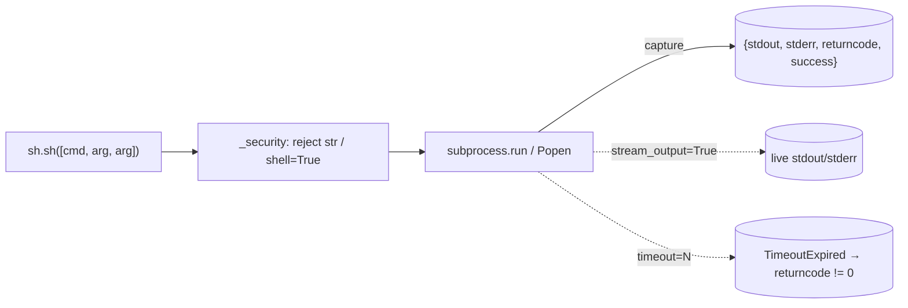
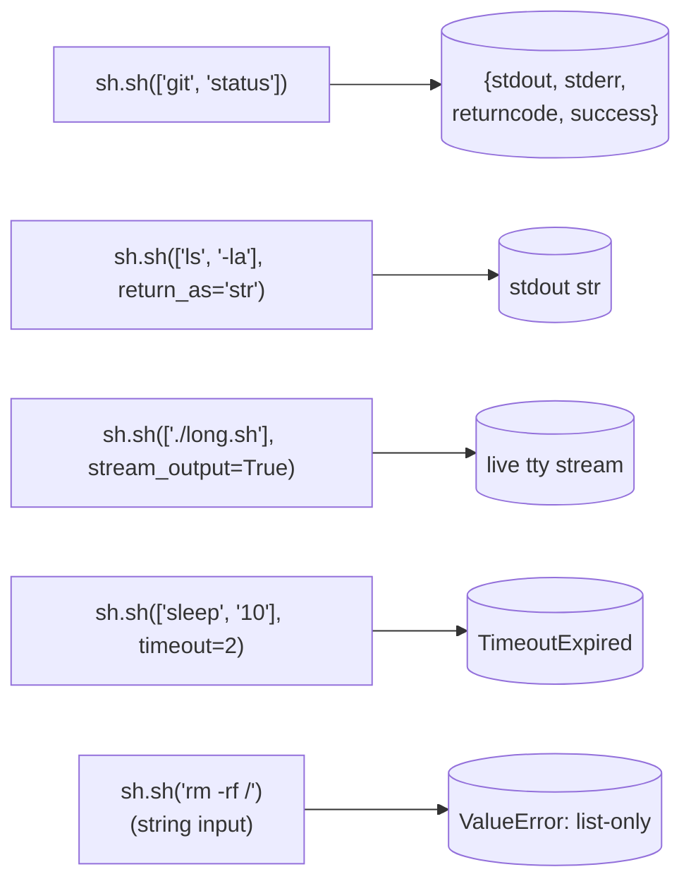

# scitex-sh

<p align="center">
  <a href="https://scitex.ai">
    
  </a>
</p>

<p align="center"><b>Safe subprocess wrapper — list-only (no shell-string parsing), structured result, timeouts, streaming.</b></p>

<p align="center">
  <a href="https://scitex-sh.readthedocs.io/">Full Documentation</a> · <code>uv pip install scitex-sh[all]</code>
</p>

<!-- scitex-badges:start -->
<p align="center">
  <a href="https://pypi.org/project/scitex-sh/"></a>
  <a href="https://pypi.org/project/scitex-sh/"></a>
  <a href="https://github.com/ywatanabe1989/scitex-sh/actions/workflows/test.yml"></a>
  <a href="https://github.com/ywatanabe1989/scitex-sh/actions/workflows/install-test.yml"></a>
  <a href="https://codecov.io/gh/ywatanabe1989/scitex-sh"></a>
  <a href="https://scitex-sh.readthedocs.io/en/latest/"></a>
  <a href="https://www.gnu.org/licenses/agpl-3.0"></a>
</p>
<!-- scitex-badges:end -->

---

## Installation

```bash
pip install scitex-sh
```

## Architecture

```
src/scitex_sh/
├── __init__.py         # public re-exports: sh, sh_run, quote
├── _execute.py         # core sh() — list-only argv, dict result, streaming, timeouts
├── _security.py        # reject shell=True / string-cmd inputs (refuse silent injection)
├── _shell_legacy.py    # opt-in legacy shell-string path (kept off by default)
└── _types.py           # ShResult TypedDict
```



## 1 Interfaces

<details open>
<summary><strong>Python API</strong></summary>

<br>

```python
import scitex_sh as sh

# Dict result (stdout / stderr / returncode / success)
res = sh.sh(["git", "status"])

# String result
out = sh.sh(["ls", "-la"], return_as="str")

# Streamed output
sh.sh(["./long-running.sh"], stream_output=True)

# Timeout
sh.sh(["sleep", "10"], timeout=2)

# Lower-level
res = sh.sh_run(["echo", "hi"])
sh.quote("hello world")            # 'hello world' (POSIX-quoted)
```

</details>

## Demo



## Quick Start

```python
import scitex_sh as sh

res = sh.sh(["git", "status"])
print(res["stdout"])
```

## Status

Standalone fork of `scitex.sh`. Zero deps (pure stdlib). The umbrella package's
`scitex.sh` import path is preserved via a `sys.modules`-alias bridge. The
`scitex.str.color_text` dep used for terminal output is replaced with a tiny
inline ANSI helper that respects `NO_COLOR` and TTY detection.

## Part of SciTeX

`scitex-sh` is part of [**SciTeX**](https://scitex.ai). Install via
the umbrella with `pip install scitex[sh]` to use as
`scitex.sh` (Python) or `scitex sh ...` (CLI).

>Four Freedoms for Research
>
>0. The freedom to **run** your research anywhere — your machine, your terms.
>1. The freedom to **study** how every step works — from raw data to final manuscript.
>2. The freedom to **redistribute** your workflows, not just your papers.
>3. The freedom to **modify** any module and share improvements with the community.
>
>AGPL-3.0 — because we believe research infrastructure deserves the same freedoms as the software it runs on.

## License

AGPL-3.0-only (see [LICENSE](./LICENSE)).

---

<p align="center">
  <a href="https://scitex.ai" target="_blank"></a>
</p>
